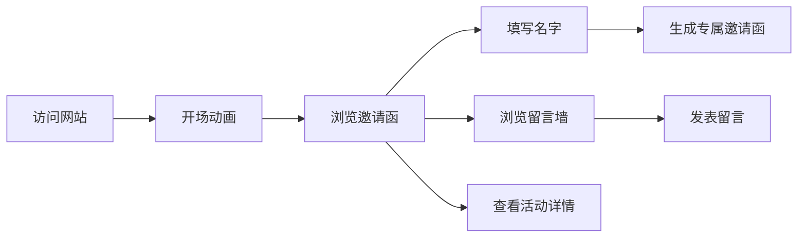

## 1. 产品概述

毕业典礼电子邀请函动态网站，为毕业生提供一个充满仪式感和互动性的在线邀请函平台。用户可以填写自己的名字生成专属邀请函，并在留言墙上留下毕业祝福。

- 核心目标：打造一个视觉精美、互动性强的毕业纪念平台，让毕业生和亲友共同分享毕业喜悦
- 目标用户：应届毕业生、毕业生亲友、学校老师

## 2. 核心功能

### 2.1 用户角色
| 角色 | 参与方式 | 核心权限 |
|------|----------|----------|
| 访客用户 | 直接访问网站 | 浏览邀请函、填写名字、发表留言、查看留言墙 |

### 2.2 功能模块
1. **邀请函首页**：动态开场动画、毕业主题视觉、活动信息展示
2. **名字定制**：用户输入姓名生成专属邀请函，可分享
3. **留言墙**：实时展示毕业祝福留言，支持发表新留言
4. **活动详情**：毕业典礼时间、地点、流程安排

### 2.3 页面详情
| 页面名称 | 模块名称 | 功能描述 |
|----------|----------|----------|
| 单页应用 | 开场动画 | 粒子飘落效果、渐显文字、卷轴展开动效 |
| 单页应用 | 邀请函主体 | 毕业主题背景、标题、时间地点信息 |
| 单页应用 | 名字定制区 | 输入框、生成按钮、专属邀请函预览 |
| 单页应用 | 留言墙 | 留言列表、发表留言表单、实时更新 |
| 单页应用 | 活动流程 | 毕业典礼日程安排时间线 |

## 3. 核心流程

用户访问网站 → 观看开场动画 → 浏览邀请函内容 → 填写名字生成专属邀请函 → 浏览/发表留言 → 查看活动详情

## 4. 用户界面设计

### 4.1 设计风格
- **主色调**：深红色 + 金色（庄重而喜庆的毕业氛围）
- **辅助色**：米白色背景、深棕色文字
- **按钮风格**：圆角金边按钮，悬停有光泽流动效果
- **字体**：标题使用宋体/衬线字体体现正式感，正文使用优雅的无衬线字体
- **布局风格**：竖向卷轴式布局，卡片层叠效果
- **装饰元素**：毕业帽、文凭、丝带、樱花/银杏叶飘落动画

### 4.2 页面设计概述
| 页面名称 | 模块名称 | UI 元素 |
|----------|----------|---------|
| 单页应用 | 开场动画 | 粒子背景、渐显标题、淡入淡出过渡 |
| 单页应用 | 邀请函主体 | 金色边框、花纹装饰、庄重排版 |
| 单页应用 | 名字定制区 | 优雅输入框、生成按钮、动效展示 |
| 单页应用 | 留言墙 | 便签式留言卡片、瀑布流布局 |
| 单页应用 | 活动流程 | 时间线样式、图标点缀 |

### 4.3 响应式设计
- 桌面端优先设计，移动端自适应
- 移动端优化触控交互，按钮尺寸适配手指点击
- 留言墙在移动端改为单列布局

### 4.4 动态效果
- 页面加载：文字逐行渐显，元素错落入场
- 滚动触发：元素随滚动淡入上移
- 名字生成：名字书写动画，邀请函翻页效果
- 留言发表：便签飘落动效
- 背景装饰：毕业帽、花瓣缓慢飘落
