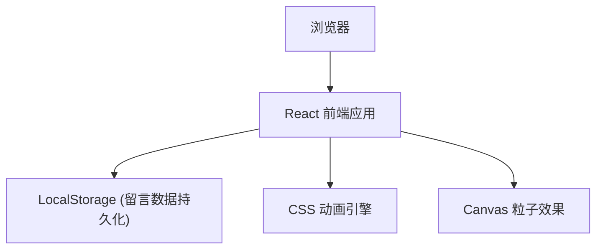

## 1. 架构设计



## 2. 技术说明

- **前端框架**：React@18 + Vite@5
- **样式方案**：TailwindCSS@3 + CSS 动画
- **状态管理**：React useState/useEffect
- **数据持久化**：LocalStorage（留言墙数据）
- **动画实现**：CSS Keyframes + Canvas 粒子效果
- **图标**：Lucide React

## 3. 模块划分

| 模块 | 功能说明 |
|------|----------|
| HeroSection | 开场动画与邀请函主视觉 |
| InvitationCard | 邀请函主体内容展示 |
| NameCustomizer | 名字定制与专属邀请函生成 |
| MessageWall | 留言墙展示与发表功能 |
| ScheduleTimeline | 毕业典礼流程时间线 |
| ParticleBackground | 粒子飘落背景动画 |

## 4. 数据模型

### 4.1 留言数据结构

```typescript
interface Message {
  id: string;
  name: string;
  content: string;
  timestamp: number;
  color: string;
}
```

### 4.2 邀请函数据

```typescript
interface InvitationData {
  graduateName: string;
  schoolName: string;
  ceremonyDate: string;
  ceremonyTime: string;
  ceremonyLocation: string;
}
```

## 5. 动画效果清单

| 动画名称 | 实现方式 | 触发时机 |
|----------|----------|----------|
| 开场渐显 | CSS opacity + transform | 页面加载 |
| 粒子飘落 | Canvas requestAnimationFrame | 持续运行 |
| 元素入场 | CSS animation-delay | 滚动触发 |
| 名字书写 | CSS stroke-dashoffset | 点击生成 |
| 留言飘落 | CSS transform + rotate | 新留言提交 |
| 按钮光泽 | CSS ::before 伪元素 | hover 状态 |
